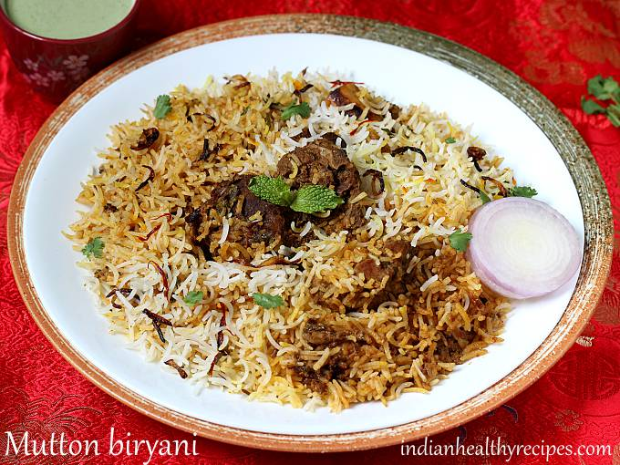

# Ajitha Narra

Mutton biryani is a rich, flavorful dish made with tender pieces of mutton, basmati rice, and fragrant spices. Slow-cooked to perfection, it combines the aromatic flavors of the meat and spices, creating a deliciously satisfying meal that's loved by many.

